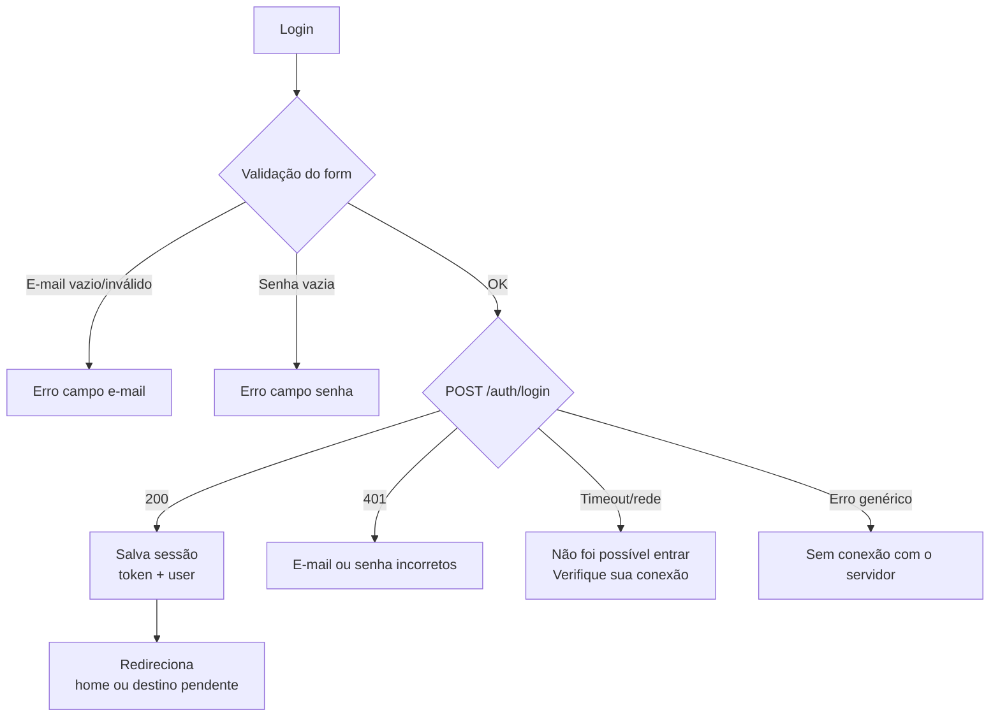
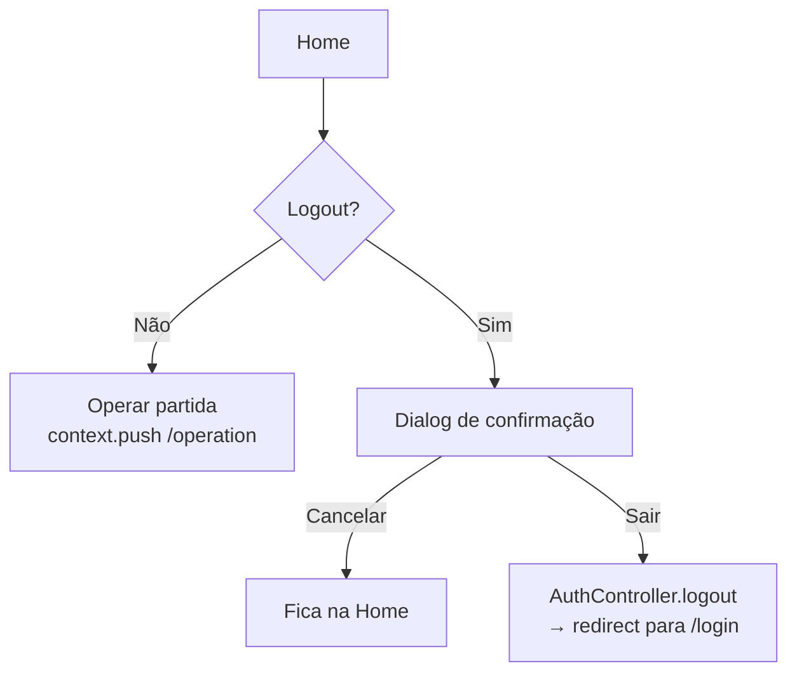
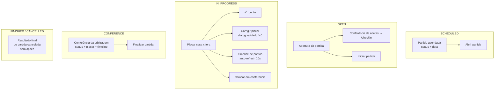
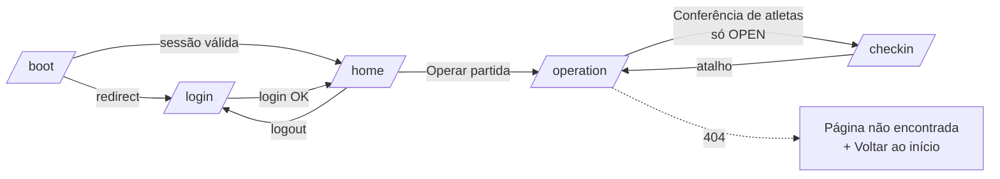

# Fluxo de Telas — Flag Referee App

> Documento de navegação do app da mesa (Referee App). Reflete o estado atual do código em `develop`.

## Rotas (GoRouter)

| Rota | Nome | Tela | Autenticação |
|------|------|------|--------------|
| `/boot` | `boot` | Boot (restauração de sessão) | Pública (temporária) |
| `/login` | `login` | Login da mesa | Pública |
| `/` | `home` | Home (painel da mesa) | **Privada** |
| `/operation` | `operation` | Operação de partida | **Privada** |
| `/checkin` | `checkin` | Check-in de atletas | **Privada** |

---

## 1. Fluxo de Autenticação (redirecionamento global)

O `AppRouter` usa o `AuthController` como `refreshListenable`: qualquer mudança de estado de autenticação reavalia o redirect.

```mermaid
flowchart TD
    A[App inicia] --> B{/boot<br/>Restaurando sessão}
    B -->|Token válido| C[Authenticated]
    B -->|Sem token / token inválido| D[Não autenticado]

    C -->|Tentava acessar rota privada| C1[Redireciona ao destino pendente]
    C -->|Acesso direto| C2[Redireciona para /]
    C1 --> E[Home]
    C2 --> E

    D -->|Redireciona para /login| F[Login]
    F -->|Login OK| G{Authenticated}
    G -->|Existe destino pendente| H[Destino pendente<br/>ex: /operation]
    G -->|Acesso direto| I[/]
```

### Cenário A — Primeiro acesso (sem sessão)
1. Usuário abre o app → `/boot` (flash de "Restaurando sessão...").
2. `SessionManager.getToken()` retorna `null` → estado `unauthenticated`.
3. Redireciona para `/login`.

### Cenário B — Sessão persistida válida
1. Abre o app → `/boot`.
2. Token existe → `AuthApi.me()` valida e carrega o `User`.
3. Estado `authenticated` → redireciona para `/`.

### Cenário C — Sessão expirada/corrompida
1. Abre o app → `/boot`.
2. `me()` falha → `SessionManager.clear()` limpa o storage.
3. Estado `unauthenticated` → redireciona para `/login`.

### Cenário D — Tentou rota privada sem login (redirect com retorno)
1. Usuário tenta acessar `/operation` sem sessão.
2. Guarda o destino em `pendingDestination`.
3. Redireciona para `/login`.
4. Após login, volta **para `/operation`** (não para a home).

---

## 2. Login



- Campos: **E-mail** (valida presença e `@`) e **Senha** (valida presença).
- Botão **Entrar** mostra spinner enquanto submete.
- Mensagens de erro amigáveis (nunca ecoa o texto cru da API).

---

## 3. Home



- Exibe "Bem-vindo, {nome}!".
- Botão principal **Operar partida**.
- Ícone de logout no AppBar com **confirmação** ("Deseja realmente encerrar a sessão?").

---

## 4. Operação de Partida (`/operation`)

Tela principal do fluxo de arbitragem. Compartilha o **seletor de contexto** com o check-in (`GameContextSelector`).

### 4.1 Cascata de seleção (Campeonato → Rodada → Jogo)

```mermaid
flowchart TD
    A[/operation] --> B{Carrega campeonatos}
    B -->|Loading| B1[AppLoading]
    B -->|Erro| B2[AppErrorState + Retry]
    B -->|Vazio| B3[AppEmptyState<br/>Nenhum campeonato]
    B -->|Dados| C[Dropdown Campeonato<br/>default: primeiro]

    C --> D[Carrega rodadas]
    D -->|Dados| E[Dropdown Rodada<br/>default: primeira]
    E --> F[Carrega jogos]
    F -->|Dados| G[Dropdown Jogo<br/>SEM auto-seleção]
    G -->|Usuário seleciona| H[Painel de operação<br/>conforme status do jogo]
    G -->|Nenhum selecionado| I[AppEmptyState<br/>Selecione o jogo na rodada]
```

- A cascata é **compartilhada** via `StateProviders` (`selectedCompetitionProvider`, `selectedRoundProvider`, `selectedGameProvider`).
- Trocar campeonato **reseta** rodada e jogo; trocar rodada **reseta** jogo.
- O jogo **não é auto-selecionado** — até escolher, mostra estado vazio orientador.

### 4.2 Máquina de estados da partida (painel de operação)

```mermaid
stateDiagram-v2
    [*] --> SCHEDULED: Jogo selecionado
    SCHEDULED --> OPEN: Abrir partida (confirmação)
    OPEN --> IN_PROGRESS: Iniciar partida (confirmação)
    IN_PROGRESS --> CONFERENCE: Colocar em conferência (confirmação)
    CONFERENCE --> FINISHED: Finalizar partida (confirmação)
    [*] --> CANCELLED: Partida cancelada (externa)
    FINISHED --> [*]
    CANCELLED --> [*]

    note right of OPEN: Acesso à "Conferência de atletas"<br/>só quando OPEN (issue #490)
    note right of CONFERENCE: Sentido único:<br/>CONFERENCE só sai para FINISHED
```

### 4.3 Painéis por status

| Status | Card exibido | Ações disponíveis |
|--------|-------------|-------------------|
| **SCHEDULED** | "Partida agendada" (status + data) | **Abrir partida** |
| **OPEN** | "Abertura da partida" | **Conferência de atletas** → `/checkin` · **Iniciar partida** |
| **IN_PROGRESS** | Placar ao vivo (casa x fora) | **+1 ponto** por time · **Corrigir placar** · timeline · **Colocar em conferência** |
| **CONFERENCE** | "Conferência da arbitragem" + timeline | **Finalizar partida** |
| **FINISHED** | "Resultado final" (status + placar) | — (sem ações) |
| **CANCELLED** | "Partida cancelada" | — (sem ações) |



### Comportamentos importantes
- **Auto-refresh de 10s** apenas em `IN_PROGRESS` — invalida o jogo e os eventos de pontuação.
- **Anti-duplo-toque**: botão "+1" trava enquanto o POST de ponto está em andamento.
- **+1 desabilitado** quando `homeTeamId`/`awayTeamId` é nulo.
- **Corrigir placar**: dialog com validação (inteiro ≥ 0) — não converte inválido para 0.
- Todas as transições de status exigem **dialog de confirmação**.

---

## 5. Check-in de Atletas (`/checkin`)

Acessado a partir da operação (somente com partida **OPEN**) ou por URL direta.

```mermaid
flowchart TD
    A[/checkin] --> B[GameContextSelector<br/>mesma cascata compartilhada]
    B --> C{Carrega check-ins do jogo}
    C -->|Loading| C1[AppLoading]
    C -->|Erro| C2[AppErrorState + Retry]
    C -->|Vazio| C3[AppEmptyState<br/>Nenhum atleta nos times]
    C -->|Dados| D[Resumo: N/M presentes + barra]
    D --> E[Seção Time da Casa]
    D --> F[Seção Time Visitante]

    E --> G{Ações por atleta}
    F --> G

    G -->|Sempre| H[Numeração da partida<br/>dialog: vazio = oficial, senão > 0]
    G -->|Somente OPEN| I[Validar / Validado]
    G -->|Somente OPEN| J[Presente / Não compareceu]
```

### Regras por status da partida
- **OPEN** → mesa pode conferir presença: **Validar**, marcar **Presente**, **Não compareceu**, e editar **numeração da partida**.
- **Fora de OPEN** → apenas edição de **numeração** (conferência bloqueada — issue #488).
- Após validar, o botão vira **"Validado"** desabilitado.
- Se a validação retorna `NOT_REGISTERED`, mostra snackbar "não está no roster".

### Atalhos
- AppBar tem ícone de atalho para `/operation` (e a operação leva ao check-in quando OPEN).

---

## 6. Mapa Geral de Navegação



---

## 7. Resumo de Dependências de Dados

| Tela | Providers consumidos | API |
|------|---------------------|-----|
| Login | `authControllerProvider` | `POST /auth/login`, `GET /auth/me` |
| Home | `authControllerProvider` | — |
| Operação | `competitionsProvider`, `roundsProvider`, `gamesByRoundProvider`, `gameScoreEventsProvider`, `gameApiProvider` | `GET /competitions`, `GET /competitions/{id}/rounds`, `GET /rounds/{id}/games`, `PATCH /games/{id}/status`, `POST /games/{id}/score/events`, `PATCH /games/{id}/score` |
| Check-in | `checkinProvider`, `checkInApiProvider` | `GET /games/{id}/checkin`, `POST /games/{id}/checkin/{athleteId}`, `POST .../validate`, `PUT .../match-number` |